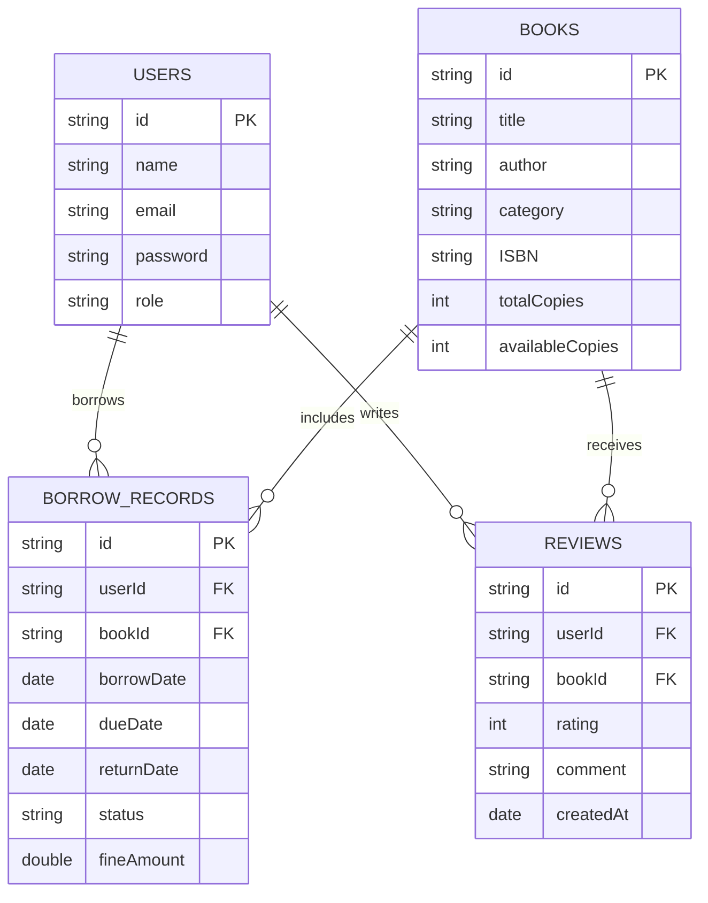

# ER Diagram – LibraLearn

```mermaid
erDiagram

    USERS {
        string id PK
        string name
        string email
        string password
        string role
    }

    BOOKS {
        string id PK
        string title
        string author
        string category
        string ISBN
        int totalCopies
        int availableCopies
    }

    BORROW_RECORDS {
        string id PK
        string userId FK
        string bookId FK
        date borrowDate
        date dueDate
        date returnDate
        string status
        double fineAmount
    }

    REVIEWS {
        string id PK
        string userId FK
        string bookId FK
        int rating
        string comment
        date createdAt
    }

    USERS ||--o{ BORROW_RECORDS : borrows
    BOOKS ||--o{ BORROW_RECORDS : includes

    USERS ||--o{ REVIEWS : writes
    BOOKS ||--o{ REVIEWS : receives
```