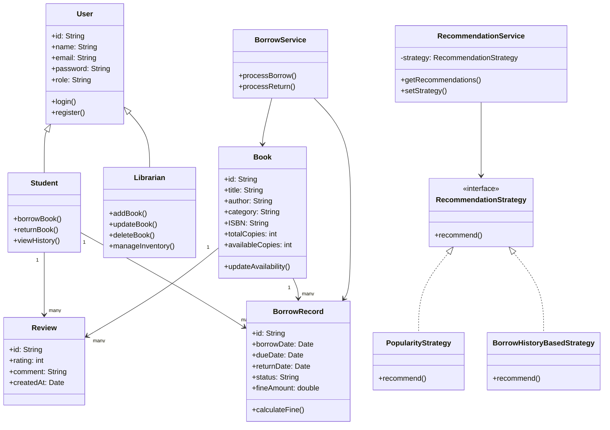

# Class Diagram – LibraLearn

```mermaid
classDiagram

%% ========================
%% Core Domain Classes
%% ========================

class User {
    +id: String
    +name: String
    +email: String
    +password: String
    +role: String
    +login()
    +register()
}

class Student {
    +borrowBook()
    +returnBook()
    +viewHistory()
}

class Librarian {
    +addBook()
    +updateBook()
    +deleteBook()
    +manageInventory()
}

User <|-- Student
User <|-- Librarian

class Book {
    +id: String
    +title: String
    +author: String
    +category: String
    +ISBN: String
    +totalCopies: int
    +availableCopies: int
    +updateAvailability()
}

class BorrowRecord {
    +id: String
    +borrowDate: Date
    +dueDate: Date
    +returnDate: Date
    +status: String
    +fineAmount: double
    +calculateFine()
}

class Review {
    +id: String
    +rating: int
    +comment: String
    +createdAt: Date
}

Student "1" --> "many" BorrowRecord
Book "1" --> "many" BorrowRecord
Student "1" --> "many" Review
Book "1" --> "many" Review

%% ========================
%% Service Layer
%% ========================

class BorrowService {
    +processBorrow()
    +processReturn()
}

class RecommendationService {
    -strategy: RecommendationStrategy
    +getRecommendations()
    +setStrategy()
}

BorrowService --> BorrowRecord
BorrowService --> Book

RecommendationService --> RecommendationStrategy

%% ========================
%% Strategy Pattern
%% ========================

class RecommendationStrategy {
    <<interface>>
    +recommend()
}

class BorrowHistoryBasedStrategy {
    +recommend()
}

class PopularityStrategy {
    +recommend()
}

RecommendationStrategy <|.. BorrowHistoryBasedStrategy
RecommendationStrategy <|.. PopularityStrategy
```