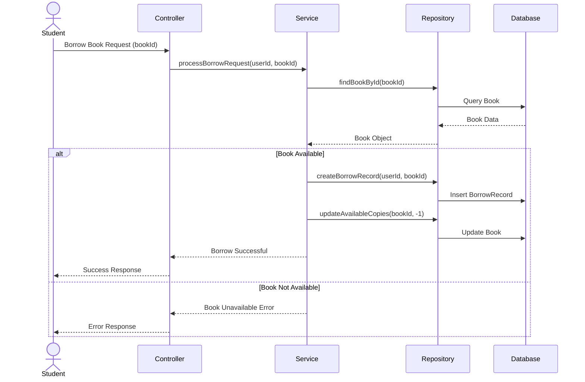

# Sequence Diagram – Borrow Book Flow

```mermaid
sequenceDiagram

actor Student
participant Controller
participant Service
participant Repository
participant Database

Student->>Controller: Borrow Book Request (bookId)

Controller->>Service: processBorrowRequest(userId, bookId)

Service->>Repository: findBookById(bookId)
Repository->>Database: Query Book
Database-->>Repository: Book Data
Repository-->>Service: Book Object

alt Book Available
    Service->>Repository: createBorrowRecord(userId, bookId)
    Repository->>Database: Insert BorrowRecord

    Service->>Repository: updateAvailableCopies(bookId, -1)
    Repository->>Database: Update Book

    Service-->>Controller: Borrow Successful
    Controller-->>Student: Success Response
else Book Not Available
    Service-->>Controller: Book Unavailable Error
    Controller-->>Student: Error Response
end
```