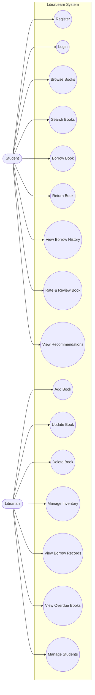

# Use Case Diagram – LibraLearn

```mermaid
flowchart LR

%% Actors
Student([Student])
Librarian([Librarian])

%% System Boundary
subgraph "LibraLearn System"

    UC1((Register))
    UC2((Login))
    UC3((Browse Books))
    UC4((Search Books))
    UC5((Borrow Book))
    UC6((Return Book))
    UC7((View Borrow History))
    UC8((Rate & Review Book))
    UC9((View Recommendations))

    UC10((Add Book))
    UC11((Update Book))
    UC12((Delete Book))
    UC13((Manage Inventory))
    UC14((View Borrow Records))
    UC15((View Overdue Books))
    UC16((Manage Students))

end

%% Student Connections
Student --> UC1
Student --> UC2
Student --> UC3
Student --> UC4
Student --> UC5
Student --> UC6
Student --> UC7
Student --> UC8
Student --> UC9

%% Librarian Connections
Librarian --> UC10
Librarian --> UC11
Librarian --> UC12
Librarian --> UC13
Librarian --> UC14
Librarian --> UC15
Librarian --> UC16
```